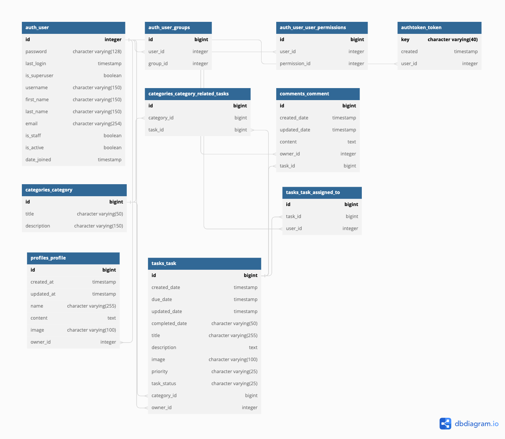

# Ticked Off API

## The Live link can be found here -> [Ticked Off API](https://pp5-productivity-tool.herokuapp.com/)


### React Frontend Project URLs

- [Frontend - Repository](https://github.com/PhantomPWR/pp5-productivity-tool-frontend)
- [Frontend - Deployed App URL](https://pp5-productivity-tool-frontend.herokuapp.com/)

<hr>

## Table of Contents

- [Database Schema](#database-schema)
- [Testing](#testing)
- [Technologies Used](#technologies-used)
  - [Languages and Frameworks Used](#languages-and-frameworks-used)
  - [Python Modules Used](#python-modules-used)
  - [Packages Used](#packages-used)
  - [Programs and Tools Used](#programs-and-tools-used)
- [Deployment](#deployment)
  - [Forking the GitHub Repository](#forking-the-github-repository)
  - [Making a Local Clone](#making-a-local-clone)
  - [Deploying with Heroku](#deploying-with-heroku)
- [Credits](#credits)
  - [Online resources](#online-resources)
  - [Code](#code)
  - [Acknowledgments](#acknowledgments)

<hr>

## Database Schema



## Testing


### Manual Testing

During development of the API, I tested each URL endpoint to confirm they work as expected. I visited each URL, confirmed to ensure accurate results were returned, creating, updating, and deleting items as appropriate:

| URL Tested | Passed |
|---|---|
|profiles/|yes|
|profiles/<int:pk>/|yes|
|profile-list/|yes|
|tasks/|yes|
|tasks/<int:pk>/|yes|
|status-choices/|yes|
|priority-choices/|yes|
|category-choices/|yes|
|categories/|yes|
|categories/<int:pk>/|yes|
|comments/|yes|
|comments/<int:pk>/|yes|

## Code Validation

I've been using the `pycodestyle` package to validate the project against the PEP8 Style Convention during development. 
All files passed, **except** settings.py and migration files, which contained "line too long" warnings. I left these untouched to eliminate the risk of breaking code automatically generated by Django.

</details>

<hr>

## Technologies Used

### Languages and Frameworks

- [Python](https://www.python.org/)
- [Django](https://pypi.org/project/Django/3.2.14/)
- [Django-REST-framework](https://www.django-rest-framework.org/) - Toolkit for building web API's with Django.

### Python Modules

- Built-in Packages/Modules
  - [os](https://docs.python.org/3/library/os.html) - Used for operating system-dependent functionality.

### Packages

- External Python Packages
  - [cloudinary](https://pypi.org/project/cloudinary/) - Cloudinary intergration.
  - [django-cloudinary-storage](https://pypi.org/project/django-cloudinary-storage/) - Cloudinary intergration.
  - [dj-database-url](https://pypi.org/project/dj-database-url/)
  - [django-allauth](https://pypi.org/project/django-allauth/) 
  - [dj-rest-auth](https://pypi.org/project/dj-rest-auth/) 
  - [django-filter](https://pypi.org/project/django-filter/) 
  - [djangorestframework-simplejwt](https://pypi.org/project/djangorestframework-simplejwt/)
  - [django-cors-headers](https://pypi.org/project/django-cors-headers/) 
  - [gunicorn](https://pypi.org/project/gunicorn/) 
  - [Pillow](https://pypi.org/project/Pillow/) 
  - [psycopg2](https://pypi.org/project/psycopg2) 


### Programs and Tools Used

- [dbDiagram](https://dbdiagram.io/) - For creating the Entity Relationship Diagram
- [GitPod](https://www.gitpod.io/) - Online development environment
- [GitHub](https://github.com/) - Version Control

<hr>

## Deployment

### Forking the GitHub Repository

Fork the repository using the following steps:

1. Log in to GitHub and search for [PhantomPWR/pp5-productivity-tool-backend](https://github.com/PhantomPWR/pp5-productivity-tool-backend)
2. Above the "Code" button, locate the "Fork" button (Currently located between "Watch" & "Star" buttons).
3. Be sure to click on "Fork" - not the number next to it.
4. You should now have a copy of the original repository in your GitHub account.

### Making a Local Clone

**IMPORTANT**: The project requires Python version 3.8 or higher installed locally.

1. Log in to GitHub and search for [PhantomPWR/pp5-productivity-tool-backend](https://github.com/PhantomPWR/pp5-productivity-tool-backend)
1. Under the repository name, click "Code".
1. Copy the URL under HTTPS
1. In your local terminal, confirm you have git installed
1. Change your current working directory to the location where you want the cloned directory to be created.
1. Enter `git clone`, and paste https://github.com/PhantomPWR/pp5-productivity-tool-backend

    ```console
    ~$ git clone https://github.com/PhantomPWR/pp5-productivity-tool-backend
    ```

1. Press "Enter" and your local clone should be created.

1. Change your current working directory to the cloned project folder.

1. Packages required by the project can now using the command `pip install -r requirements.txt`
1. In the cloned directory, rename the file `.env-example` to `.env` and populate it with the information required.
1. Make Django migrations using the command `./manage.py migrate`.

### Deploying to Heroku

**Prerequisites**: 
- A Cloudinary account: [https://cloudinary.com](https://cloudinary.com).
- A Postgresql database, e.g. on Heroku, ElephantSQL, etc.


1. Log in to [Heroku](https://www.heroku.com/) and navigate to your personal app dashboard.
2. At the top right of the page, open the 'New' drop down and select 'Create new app'.
3. Name your application, select a region and click 'Create app'.
4. Under the 'Settings' section, click 'Reveal Config Vars' in the Config vars section.
5. Enter the following key / value pairs:

|KEY|VALUE|
|--|--|
| ALLOWED_HOSTS | name-of-your-project.herokuapp.com |
|DATABASE_URL|e.g. postgres://********:*******************@*****.db.elephantsql.com/********|
|CLOUDINARY_URL|e.g. `cloudinary://**************:**************@*********`|
|SECRET_KEY|generated with [https://djecrety.ir](https://djecrety.ir/)|
|CLIENT_ORIGIN|URL of the frontend app you'll be making API requests from|
|CLIENT_ORIGIN_DEV|IP Address or URL of your development server|

**Deploy Page**
1. Navigate to the 'Deploy' page.
9. Select 'GitHub' from the 'Deployment method' section and 'Connect to GitHub'.
10. Once connected to GitHub, search for your repository which contains the forked 'property-direct-backend' repository.
11. Click 'Connect'.
12. Under 'Manual deploy', select the 'main' branch and click 'Deploy'.
13. Once deployment is complete, click 'View' open the deployed application.

<hr>

## Credits

### Online resources

- [Django Documentation](https://docs.djangoproject.com/en/4.1/)
- [Django REST Documentation](https://www.django-rest-framework.org/)
- [Code with Mosh](https://codewithmosh.com/courses)

### Code

- Code Institute DRF Walkthrough Project
  - URL: [https://github.com/Code-Institute-Solutions/drf-api](https://github.com/Code-Institute-Solutions/drf-api)

### Acknowledgments
Starting point for code: [CI Django Rest Framework Walkthrough](https://github.com/Code-Institute-Solutions/drf-api)
README: For structure and which sections to include, I took inspiration from [Niclas Tanskanen](https://github.com/niclastanskanen)